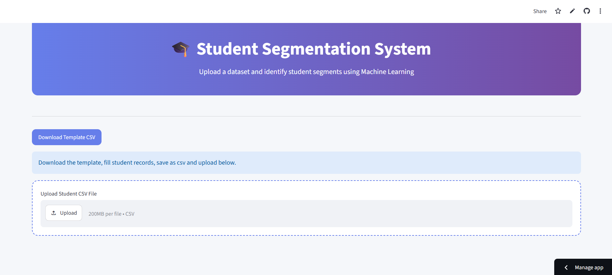

# Student_Social_Network_Profile_Segmentation

#### Project Overview
This project focuses on Student Segmentation using Unsupervised Machine Learning. The objective is to identify groups of students with similar interests, social behavior, demographic characteristics, and online activity patterns based on the Students' Social Network Profile dataset.

The project applies multiple clustering algorithms and compares their performance using the Silhouette Score to determine the most suitable clustering technique.

#### Business Objective
Educational institutions and student organizations can use student segmentation to:

* Understand student interests and behavior.
* Identify highly engaged and less engaged students.
* Design targeted activities and campaigns.
* Improve student participation and engagement.
* Perform demographic and interest-based profiling.

#### Dataset

Dataset: Student's Social Network Profile Dataset
Faeture include:
* Demographic information
   - Gender
   - Age
   - Graduation Year
* Social Newtwork Metrics
   - Number of Friends
* Interest Categories
   - Sports
   - Music
   - Dance
   - Shopping
   - Fashion
   - Religion
   - Lifestyle
   - Entertainment
   - Risk-related keywords
 
 #### Technologies USed

  * Python
  * Pandas
  * Numpy
  * Matplotlib
  * Seaborn
  * Scikit-Learn
  * Joblib
  * Streamlit

 #### Exploratory Data Analysis (EDA)

  The following analysis were performed
  * Dataset Overview
  * Missing Value Analysis
  * Duplicate Value Detection
  * Data Type Validation
  * Gender Distribution
  * Age Distribution
  * Interest Distribution
  * Correlation Analysis
  * Cluster Visualization using PCA
 
#### Data Preprocessing
##### Missing Value Treatment
 * Age : Missing values replaced using Median
 * Gender : Missing values replaced using Mode.

##### Data Type Conversion
* Age converted from string to numeric format

##### Duplicate Removal
* Duplicate records were identified and removed.

##### Skewness Analysis
* Numerical features were analyzed for skewness.
* Log transformation applied to highly skewed features where required.

##### Outlier Detection
* IQR (Interquartile Range) Method used for outlier detection.

##### Feature Scaling
* StandardScaler applied to normalize feature values before clustering.

#### Clustering Algorithms Implemented
##### 1. K-Means Clustering
* Elbow Method used for cluster selection.
* Multiple cluster values evaluated.
* Best silhouette score achieved at K=2.

##### 2. Hierarchical Clustering
* Agglomerative Clustering applied.
* Multiple cluster values evaluated.

##### 3. DBSCAN
* Tested using different EPS values.
* Compared against K-Means and Hierarchical Clustering.

#### Best Model Selection
Although none of the clustering algorithms achieved a very high silhouette score, K-Means with K=2 produced the highest score among all tested configurations.

Therefore, K-Means was selected as the final model for deployment.

#### PCA Visualization
Principal Component Analysis (PCA) was used to reduce dimensions and visualize student clusters in a 2-dimensional space.

#### Model Persistence
The following files were saved using Joblib:

kmeans_model.pkl
scaler.pkl
label_encoder.pkl
feature_names.pkl

#### Streamlit Deployment
The project includes an interactive Streamlit application

##### Faetures
* Download Template CSV
* Upload Student Dataset
* Automatic Data Validation
* Gender Encoding
* Feature Scaling
* Cluster Prediction
* Segment Identification
* Cluster Distribution Visualization
* Download Results

#### Application Workflow
1. Download CSV Template
2. Enter Student Data
3. Upload CSV File
4. Predict Student Segments
5. Visualize Cluster Distribution
6. Download Segmented Results

#### Streamlit Web Link:

https://priya-srivastava-studentsocialnetworkprofilesegmentation.streamlit.app/

#### Conclusion
This project successfully demonstrates how unsupervised machine learning can be used to segment students based on demographic characteristics, social interactions, and interest patterns.

The developed clustering solution enables data-driven student profiling and provides a foundation for targeted engagement strategies and trend analysis.

 

